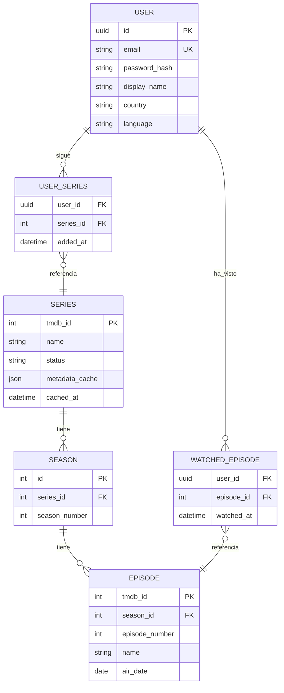

# SeriesTracker — Análisis funcional (MVP v1.0)

## 1. Objetivo

Aplicación web personal para el seguimiento de series de plataformas de streaming: búsqueda y consulta de información de series, marcado de episodios vistos, gestión de favoritas y calendario de estrenos por usuario.

## 2. Alcance del MVP

**Incluido:** registro/login de usuarios, búsqueda de series, ficha de serie (info, temporadas, episodios, dónde verla), marcar episodios/temporadas como vistos, series favoritas ("mis series"), calendario de estrenos de las series seguidas.

**Excluido (fases posteriores):** notificaciones (email/push), valoraciones y reseñas, listas compartidas entre usuarios, estadísticas de visionado, seguimiento de películas, apps móviles nativas.

## 3. Actores

| Actor | Descripción |
|---|---|
| Usuario anónimo | Puede registrarse e iniciar sesión. Puede buscar series y ver fichas (solo lectura). |
| Usuario registrado | Todo lo anterior + gestionar favoritas, marcar vistos, ver su calendario. |
| Sistema (TMDB) | Fuente externa de metadatos de series, episodios, fechas de emisión y proveedores de streaming. |

## 4. Requisitos funcionales

### RF-01 Gestión de usuarios
- RF-01.1 Registro con email y contraseña (verificación de email opcional en MVP).
- RF-01.2 Login/logout con sesión persistente (token).
- RF-01.3 Perfil: nombre visible, avatar (opcional), país (para mostrar proveedores de streaming correctos) e idioma de los metadatos.
- RF-01.4 Baja de usuario con borrado de sus datos.

### RF-02 Búsqueda y ficha de serie
- RF-02.1 Búsqueda por título con resultados paginados (título, año, póster, plataforma).
- RF-02.2 Ficha de serie: sinopsis, género, estado (en emisión/finalizada), póster, valoración TMDB, temporadas y episodios (número, título, fecha de emisión, sinopsis), y plataformas donde verla en el país del usuario.
- RF-02.3 Los datos provienen de TMDB; se cachean localmente (ver arquitectura).

### RF-03 Seguimiento
- RF-03.1 Añadir/quitar una serie de "mis series" (favoritas/seguidas).
- RF-03.2 Marcar/desmarcar un episodio como visto (con fecha de visionado).
- RF-03.3 Marcar una temporada completa como vista (marca todos sus episodios).
- RF-03.4 Indicador de progreso por serie: episodios vistos / totales y "siguiente episodio por ver".
- RF-03.5 Vista "Mis series" con progreso, ordenable por último visionado o próximo estreno.

### RF-04 Calendario de estrenos
- RF-04.1 Vista mensual y semanal con los episodios que se estrenan de las series seguidas por el usuario.
- RF-04.2 Cada entrada enlaza a la ficha de la serie/episodio.
- RF-04.3 Las fechas se actualizan automáticamente desde TMDB (job de refresco).

## 5. Requisitos no funcionales

| Código | Requisito |
|---|---|
| RNF-01 | Coste de infraestructura ~0 € (capas gratuitas), escalable si crece el uso. |
| RNF-02 | Web responsive (uso principal en móvil y escritorio). |
| RNF-03 | Respuesta < 1 s en operaciones sobre datos cacheados; < 3 s si requiere llamada a TMDB. |
| RNF-04 | Respetar límites de la API de TMDB (~50 req/s) mediante caché y rate limiting propio. |
| RNF-05 | Contraseñas con hash (bcrypt/argon2), tokens JWT con expiración, HTTPS obligatorio. |
| RNF-06 | Cumplimiento RGPD básico: consentimiento, exportación y borrado de datos personales. |
| RNF-07 | Atribución obligatoria a TMDB en la interfaz (requisito de sus términos de uso). |
| RNF-08 | Idiomas de interfaz: español (metadatos según idioma del perfil, soportado por TMDB). |

## 6. Modelo de datos conceptual

Nota: `SERIES/SEASON/EPISODE` son una **caché local de TMDB** (no la fuente de verdad). Los datos de usuario (`USER`, `USER_SERIES`, `WATCHED_EPISODE`) sí son propios.

## 7. Casos de uso principales

**CU-01 Buscar y seguir una serie:** el usuario busca "Severance" → ve resultados → abre la ficha → pulsa "Seguir". La serie aparece en "Mis series" y sus estrenos en su calendario.

**CU-02 Marcar progreso:** desde la ficha o desde "Mis series", el usuario marca E03 de la T2 como visto → el progreso se actualiza y el "siguiente por ver" pasa a E04.

**CU-03 Consultar calendario:** el usuario abre el calendario mensual → ve que el jueves se estrena un episodio de una serie que sigue → pulsa y llega a la ficha del episodio.

## 8. Criterios de aceptación del MVP

1. Un usuario nuevo puede registrarse, buscar una serie, seguirla y marcar episodios vistos en menos de 2 minutos.
2. El calendario muestra correctamente los estrenos de los próximos 30 días de todas las series seguidas.
3. El progreso de visionado se conserva entre sesiones y dispositivos.
4. La aplicación funciona en móvil (viewport ≥ 360 px) y escritorio.
5. Coste de infraestructura mensual: 0 €.
