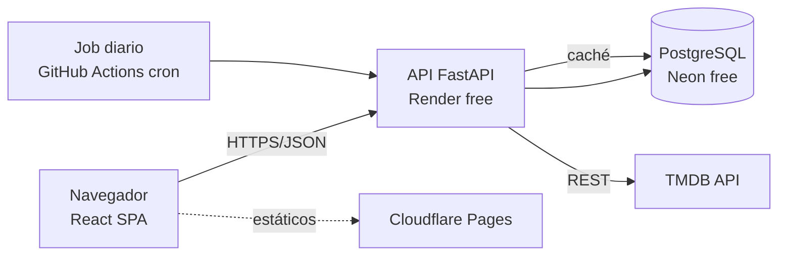

# trackmyseries — Arquitectura técnica

## 1. Visión general

SPA en el navegador + API REST en FastAPI + PostgreSQL, con TMDB como fuente externa cacheada. Todo en capas gratuitas.



## 2. Stack y servicios (capa gratuita)

| Capa | Tecnología | Servicio | Free tier |
|---|---|---|---|
| Frontend | React 18 + Vite + TypeScript + Tailwind | Cloudflare Pages | Ilimitado (estáticos) |
| Backend | Python 3.12 + FastAPI + SQLAlchemy 2 + Pydantic v2 | Render (web service free) | 750 h/mes, duerme tras inactividad |
| BD | PostgreSQL 16 | Neon | 0,5 GB, autosuspend |
| Jobs | Cron | GitHub Actions (schedule) | 2.000 min/mes |
| CI/CD | GitHub Actions | GitHub | Gratis (repo público) o 2.000 min |
| Datos externos | TMDB API v3 | — | Gratis uso no comercial (API key) |

Alternativas equivalentes si algún free tier cambia: Fly.io o Railway (backend), Supabase (BD + auth), Vercel (frontend). La arquitectura no depende de ningún servicio propietario: es un contenedor Docker + Postgres estándar, portable.

Nota sobre Render free: el servicio duerme tras 15 min sin tráfico (arranque en frío ~30-60 s). Aceptable para proyecto personal; mitigable con un ping programado si molesta.

## 3. Componentes del backend

```
app/
├── main.py               # FastAPI app, middleware, routers
├── core/                 # config (pydantic-settings), seguridad JWT, deps
├── models/               # SQLAlchemy: user, series, season, episode, user_series, watched_episode
├── schemas/              # Pydantic: request/response
├── api/
│   ├── auth.py           # registro, login, refresh
│   ├── users.py          # perfil
│   ├── series.py         # búsqueda, ficha, temporadas/episodios
│   ├── tracking.py       # favoritas, vistos, progreso
│   └── calendar.py       # estrenos
├── services/
│   ├── tmdb_client.py    # httpx async, retry, rate limit
│   ├── series_cache.py   # lógica de caché serie/temporada/episodio
│   └── tracking.py       # progreso, siguiente episodio
└── jobs/refresh.py       # refresco de series seguidas (invocado por cron)
```

## 4. API REST (contrato v1)

| Método | Endpoint | Descripción |
|---|---|---|
| POST | /api/v1/auth/register | Alta de usuario |
| POST | /api/v1/auth/login | Devuelve access + refresh JWT |
| POST | /api/v1/auth/refresh | Renueva access token |
| GET/PATCH | /api/v1/users/me | Perfil (país, idioma, nombre) |
| DELETE | /api/v1/users/me | Baja + borrado de datos (RGPD) |
| GET | /api/v1/series/search?q=&page= | Búsqueda (proxy TMDB) |
| GET | /api/v1/series/{tmdb_id} | Ficha (caché-first) |
| GET | /api/v1/series/{tmdb_id}/seasons/{n} | Episodios de una temporada |
| GET | /api/v1/series/{tmdb_id}/providers | Dónde verla (país del usuario) |
| GET/POST/DELETE | /api/v1/me/series[/{tmdb_id}] | Mis series (listar/seguir/dejar de seguir) |
| PUT/DELETE | /api/v1/me/episodes/{episode_id}/watched | Marcar/desmarcar visto |
| PUT | /api/v1/me/series/{tmdb_id}/seasons/{n}/watched | Temporada completa vista |
| GET | /api/v1/me/series/{tmdb_id}/progress | Progreso y siguiente episodio |
| GET | /api/v1/me/calendar?from=&to= | Estrenos de mis series en rango |
| POST | /api/v1/internal/refresh | Job de refresco (protegido por API key interna) |

Convenciones: JSON, errores RFC 7807 (`application/problem+json`), paginación `page`/`page_size`, versionado por prefijo `/v1`.

## 5. Integración con TMDB

- **Cliente:** `httpx.AsyncClient` con timeout 10 s, 3 reintentos con backoff exponencial y limitador propio (token bucket, ≤ 40 req/s de margen sobre el límite de TMDB).
- **Estrategia caché-first:** la ficha se sirve de BD si `cached_at < 24 h` (7 días para series finalizadas); si no, se refresca de TMDB en la misma petición y se actualiza la caché. La búsqueda va siempre a TMDB (no se cachea, resultados volátiles) con caché en memoria de 5 min por query.
- **Job diario (cron GitHub Actions, 06:00 UTC):** refresca todas las series **en emisión** que algún usuario siga → actualiza fechas de emisión de episodios futuros → el calendario queda al día sin depender del tráfico.
- **Idioma/país:** las llamadas usan `language` y `watch_region` del perfil del usuario.
- **Atribución TMDB** visible en el footer (obligatorio por sus términos).

## 6. Modelo de datos físico (PostgreSQL)

```sql
CREATE TABLE users (
  id UUID PRIMARY KEY DEFAULT gen_random_uuid(),
  email CITEXT UNIQUE NOT NULL,
  password_hash TEXT NOT NULL,
  display_name TEXT,
  country CHAR(2) NOT NULL DEFAULT 'ES',
  language TEXT NOT NULL DEFAULT 'es-ES',
  created_at TIMESTAMPTZ NOT NULL DEFAULT now()
);

CREATE TABLE series (            -- caché TMDB
  tmdb_id INT PRIMARY KEY,
  name TEXT NOT NULL,
  status TEXT,                   -- Returning Series / Ended / ...
  poster_path TEXT,
  overview TEXT,
  metadata JSONB NOT NULL,       -- resto de campos TMDB
  cached_at TIMESTAMPTZ NOT NULL
);

CREATE TABLE episodes (          -- caché TMDB (aplana temporadas)
  tmdb_id INT PRIMARY KEY,
  series_tmdb_id INT NOT NULL REFERENCES series ON DELETE CASCADE,
  season_number INT NOT NULL,
  episode_number INT NOT NULL,
  name TEXT,
  air_date DATE,
  UNIQUE (series_tmdb_id, season_number, episode_number)
);
CREATE INDEX ix_episodes_air ON episodes (series_tmdb_id, air_date);

CREATE TABLE user_series (
  user_id UUID REFERENCES users ON DELETE CASCADE,
  series_tmdb_id INT REFERENCES series,
  added_at TIMESTAMPTZ NOT NULL DEFAULT now(),
  PRIMARY KEY (user_id, series_tmdb_id)
);

CREATE TABLE watched_episodes (
  user_id UUID REFERENCES users ON DELETE CASCADE,
  episode_tmdb_id INT REFERENCES episodes ON DELETE CASCADE,
  watched_at TIMESTAMPTZ NOT NULL DEFAULT now(),
  PRIMARY KEY (user_id, episode_tmdb_id)
);
```

Decisión: se aplana `season` dentro de `episodes` (columna `season_number`) — una tabla menos sin perder nada; los metadatos de temporada viven en `series.metadata`. El calendario es una consulta: episodios de `user_series` del usuario con `air_date` en rango.

## 7. Seguridad

- Autenticación JWT: access token 30 min + refresh token 30 días (rotado). Hash de contraseñas con **argon2** (`passlib`).
- CORS restringido al dominio del frontend. HTTPS forzado (lo dan Render/Cloudflare).
- Rate limiting por IP en endpoints de auth (slowapi) contra fuerza bruta.
- La API key de TMDB y el secreto JWT viven solo en variables de entorno del backend (nunca en el frontend ni en el repo).
- RGPD: endpoint de borrado en cascada + export JSON de datos del usuario.

## 8. Frontend (React SPA)

- Vite + TypeScript, React Router, **TanStack Query** para estado de servidor (caché, revalidación), Tailwind CSS.
- Páginas: Login/Registro, Búsqueda, Ficha de serie, Mis series, Calendario (vista mes/semana), Perfil.
- Tokens en memoria + refresh token en cookie httpOnly; interceptor para renovar el access token.
- Imágenes de pósters servidas directamente desde el CDN de TMDB (`image.tmdb.org`).

## 9. Entornos y CI/CD

- **Repos:** monorepo `series-tracker` con `/backend` y `/frontend`.
- **CI (GitHub Actions):** lint (ruff, eslint) + tests (pytest, vitest) en cada PR; bloqueo de merge si fallan.
- **CD:** push a `main` → deploy automático (Render autodeploy backend, Cloudflare Pages frontend). Migraciones con **Alembic** ejecutadas en el arranque del deploy.
- **Entornos:** solo `dev` local (docker-compose con Postgres) y `prod`. No hay staging en MVP.

## 10. Riesgos técnicos

| Riesgo | Mitigación |
|---|---|
| Cold start del backend en Render free | Aceptado en MVP; ping programado o upgrade ($7/mes) si molesta |
| Cambio de condiciones de un free tier | Docker + Postgres estándar → migración a Fly/Railway/Supabase en horas |
| Límite 0,5 GB de Neon | Caché TMDB acotada (solo series seguidas + JSONB compacto); purga de series sin seguidores |
| TMDB cambia API o términos | Cliente aislado en `tmdb_client.py`; TVMaze como plan B para calendario |
